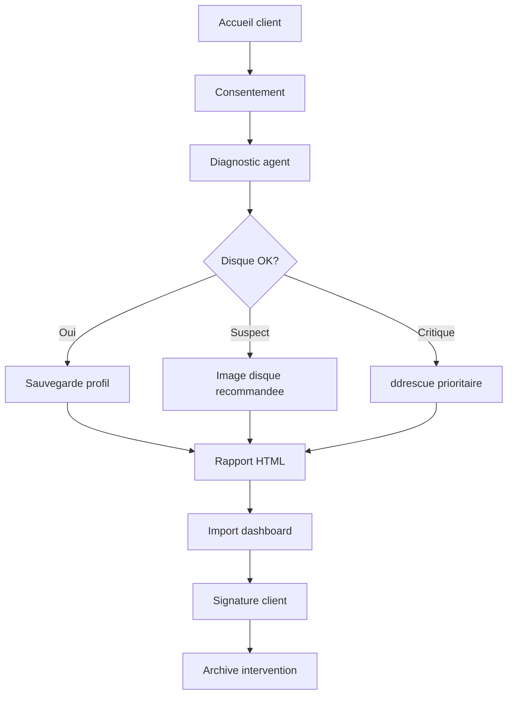

# Manuel Technicien — Restor-PC RescueGrid v3.0.0

## 1. Présentation

Restor-PC RescueGrid est une plateforme de diagnostic, sauvegarde et récupération pour techniciens atelier.

### Vue d'ensemble
| Module | Description |
|--------|-------------|
| Agent Windows | Diagnostic portable, inventaire, SMART, sauvegarde |
| Dashboard Web | Centralisation clients/machines/interventions |
| WinPE Atelier | Menu bootable pour réparation hors ligne |

### Prérequis matériels
- **Clé USB** 8 Go minimum pour WinPE
- **Disque externe** ou **NAS** pour les sauvegardes
- **Python 3.12+** pour le dashboard

---

## 2. Workflow intervention standard



### Étapes

1. **Consentement client** — Lire les 4 points, obtenir signature
2. **Lancer l'agent** — `start_agent_windows.bat` → option 1
3. **Interpréter le score** — Voir section 5
4. **Sauvegarder** — Option 2 (mode essentiel pour réinstallation)
5. **Générer le rapport** — Automatique
6. **Importer dans le dashboard** — Option 5 ou upload manuel
7. **Faire signer le client** — Section signature du rapport HTML

---

## 3. Commandes essentielles

### Diagnostic rapide (sans menu)
```powershell
powershell -ExecutionPolicy Bypass -File agent\windows\Invoke-RescueGrid.ps1 `
    -ClientName "Dupont" -BackupRoot "E:\RestorPC" -CreateZip
```

### Sauvegarde avant réinstallation
```powershell
powershell -ExecutionPolicy Bypass -File agent\windows\Invoke-RescueGrid.ps1 `
    -ClientName "Dupont" -BackupRoot "E:\RestorPC" `
    -UserProfilePath "C:\Users\Dupont" -BackupEssentialFoldersOnly -CreateZip
```

### Analyse Windows mort (WinPE)
```powershell
powershell -ExecutionPolicy Bypass -File agent\windows\Invoke-RescueGrid.ps1 `
    -ClientName "Dupont" -BackupRoot "X:\Interventions" `
    -OfflineWindowsPath "D:\Windows" -CreateZip
```

### Avec photos et signature
```powershell
powershell -ExecutionPolicy Bypass -File agent\windows\Invoke-RescueGrid.ps1 `
    -ClientName "Dupont" -BackupRoot "E:\RestorPC" `
    -UserProfilePath "C:\Users\Dupont" `
    -PhotoBefore "C:\photos\avant.jpg" -PhotoAfter "C:\photos\apres.jpg" `
    -SignatureFile "C:\signature\client.png" -CreateZip
```

---

## 4. Interprétation des résultats

### Score santé global (détail)

| Sous-score | Max | Note | Signification |
|-----------|-----|------|---------------|
| 🖴 Disque | /25 | | Santé SMART + température |
| 🧠 RAM | /10 | | Capacité mémoire |
| 🪟 Windows | /30 | | Erreurs système + BitLocker |
| 🎮 Drivers | /20 | | Pilotes + erreurs GPU |
| 🌡️ Températures | /15 | | Max disques |

**Codes couleur :**
- 🟢 Vert (≥80%) : OK
- 🟡 Orange (50-79%) : Surveillance
- 🔴 Rouge (<50%) : Intervention nécessaire

### Risque disque automatique

| Niveau | Température | Reallocated | Action |
|--------|-------------|-------------|--------|
| 🟢 healthy | <50°C | 0 | Copie fichiers standard |
| 🟡 suspect | 50-60°C | 1-10 | Image disque recommandée |
| 🔴 critical | >60°C | >10 | ddrescue prioritaire |

### Mode recommandé

Le `inventory.json` contient désormais `disk_risk.recommended_modes` :

```json
"recommended_modes": ["ddrescue", "Image disque", "Rapport seulement"]
```

---

## 5. WinPE Atelier

Depuis une clé USB WinPE, lancer :
```batch
start_winpe_menu.bat
```

Menu :
1. **Diagnostic complet** — Détecte Windows, lance l'agent
2. **Sauvegarde utilisateur** — Liste les profils disponibles
3. **Analyse SMART** — smartctl si présent
4. **Réparation boot** — bootrec (fixmbr, fixboot, rebuildbcd)
5. **Export rapport** — Rapport seul sans sauvegarde
6. **Réinstallation** — Checklist avant format
7. **Analyse offline** — Artefacts registre + journaux
8. **Vérification système** — Disques, RAM, BitLocker
9. **Quitter**

---

## 6. Dashboard Web

### Onglets
- **Interventions** : Liste chronologique avec scores, risque, lien rapport
- **Clients** : Fiches clients avec historique
- **Machines** : Historique par BIOS Serial (lien vers toutes les interventions)

### Import ZIP
Depuis le dashboard, formulaire "Importer ZIP agent" :
1. Saisir le nom du client
2. Sélectionner le fichier `.zip`
3. Cliquer "Importer"

L'import crée automatiquement :
- Client (si nouveau)
- Machine (identifiée par BIOS Serial, avec historique)
- Intervention avec scores et lien rapport

### Suppression
Boutons `X` pour supprimer une intervention ou un client.

---

## 7. Fichiers générés par intervention

```
Intervention_2026-06-16_Dupont/
├── rapport.html              ← Rapport HTML (scores, jauges, photos)
├── inventory.json            ← Inventaire complet (v3)
├── blackbox.json             ← BlackBox juridique
├── evidence_manifest.json    ← Manifeste cryptographique SHA256
├── hashes.sha256.txt         ← Empreintes SHA256
├── actions_log.txt           ← Journal horodaté
├── backup_log.txt            ← Journal robocopy
├── backup_manifest.csv       ← Manifeste fichiers récupérés
├── smart.txt                 ← Résumé SMART
├── smart_disk0.txt           ← SMART détaillé (smartctl)
├── crystal_disk0.txt         ← CrystalDiskInfo (si dispo)
├── eventlogs/                ← Journaux .evtx
├── registry_hives/           ← Ruches registre
├── bsod_dumps/               ← Dumps BSOD
├── preuves/                  ← Photos + signature
│   ├── photo_avant.jpg
│   ├── photo_apres.jpg
│   └── signature_client.png
└── backup_client/            ← Données sauvegardées
```

---

## 8. Dépannage

| Problème | Solution |
|----------|----------|
| `ExecutionPolicy` bloqué | PowerShell admin : `Set-ExecutionPolicy RemoteSigned` |
| Python introuvable | Installer Python 3.12+, cocher "Add to PATH" |
| Port 8000 occupé | Modifier dans `start_dashboard.bat` ou `.env` |
| Base verrouillée | Supprimer `backend/rescuegrid.db` |
| Machine non trouvée | Vérifier BIOS Serial dans `inventory.json` |
| SMART limité | Installer smartctl sur la clé USB |
| WinPE sans agent | Copier le dossier `agent/windows/` sur la clé |
| Photos absentes | Vérifier le chemin `-PhotoBefore` / `-PhotoAfter` |

---

## 9. Références

| Ressource | Emplacement |
|-----------|-------------|
| Guide utilisateur | `README_LANCEMENT.md` |
| Guide déploiement | `README_DEPLOIEMENT.md` |
| Architecture | `docs/ARCHITECTURE.md` |
| Roadmap | `docs/ROADMAP.md` |
| Runbook | `docs/TECHNICIAN_RUNBOOK.md` |
| Changelog | `CHANGELOG.md` |